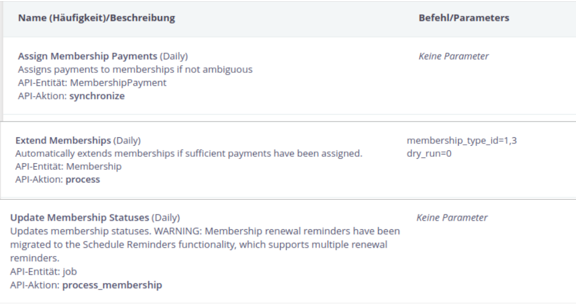

# Automation

The aim of the membership extension is to automate several processes that usually need to be done manually or where the automatization that is provided by the built-in functionalities is not compatible with a European approach of memberships.

There are independent steps that can be automated:

1. Assign contributions to memberships
2. Extend the end date of a membership if enough contributions were assigned to that membership
3. Change the status of the membership if necessary (e.g. Grace → Current)

Additionally, a membership number can be automatically set during the creation of a new membership. Further details are described [here](./configuration.md#membership-number).

## Configure scheduled jobs

The processes described in this paragraph should run automatically. Therefore it is helpful to configure scheduled jobs at **Administer > System Settings > Scheduled Jobs**. The three steps require the following three jobs:

1. Assign contributions to memberships with `MembershipPayment.synchronize`
2. Extend memberships with `Membership.process`
3. Change the status of a membership with the built-in job `Job.process_membership`

A configuration could look as follows:



!!! note
    When importing data from an external system into CiviCRM, it might be necessary to run the jobs `MembershipPayment.synchronize` and `Membership.process` several times alternating, before all contributions are mapped correctly.


## Assign contributions to memberships

You can connect existing contributions to a membership of the same contact. The contributions need to have the financial type that corresponds to the membership type as defined in the settings at [**Financial Type Mapping**](./configuration.md#financial-type-mapping). The assignment is only done for memberships with certain statuses - usually this would be active memberships. You can define the statuses in the settings page at [**Membership Statuses**](./configuration.md#membership-status).

If a membership has a payment processor assigned, contributions that belong to this payment processor are mapped to the membership automatically. The job `MembershipPayment.synchronize` is not necessary in this situation. It is mostly necessary to map other contributions to a membership.

If you want to reassign all existing contributions, you can choose the option **Rebuild Mapping**.

!!! note
    If you receive your membership fees as standing orders (german: Dauerauftrag) you can store them in CiviCRM as usual contributions. There is no need to configure recurring contributions for the mapping to work properly.

The corresponding API 3 call is `MembershipPayment.synchronize`. It will connect all payments of a certain financial type with the corresponding membership.

Available parameters are:

- `rangeback`: Backward horizon (in days). Defaults to the value in settings.
- `gracedays`: Grace Period (in days). Defaults to the value in settings.
- `rebuild`: Rebuild mapping. Caution: Will first remove all existing assignments!
- `contribution_ids`: List of contribution IDs to process. If not given, all contribution IDs will be processed.

The mapping is done on the basis of financial types, differences between the paid and expected amount are not taken into account.

## Extend memberships

This job can perform various tasks with respect to memberships:

- calculate outstanding amounts
- extend memberships that do not have an outstanding amount for the next period

The length of the next period is determined by the linked recurring contribution. For example, the membership of a contact paying yearly will be extended for one year, the membership of a contact paying monthly will be extended for one month.

The corresponding API 3 call is `Membership.process`. Available parameters are:

- `membership_type_id`: ID of the membership type IDs to process, or a comma-separated list of such membership types
- `end_date_offset`: The amount of days for which memberships are processed even after the end date has passed. This value can also be negative. If it is, only memberships that are less than `end_date_offset` days before their end date will be processed.
- `limit`: If given, only this amount of memberships will be investigated. The last membership processed will be stored, and the processing will be picked up with the next (limited) call.
- `dry_run`: If active, no changes will be performed.
- `membership_id`: ID of the membership to process, or a comma-separated list of such membership. This can be helpful for debugging and testing.

### Logging

All processed memberships are logged in a file which can be useful if you have set up the job to run automatically.

Two parameters change the logging behavior and are not exposed by the API explorer. These are

- `log_target`: The path to a file which logs the results of the process. The default is the file `P60Membership_extension.log` in the ConfigAndLog directory. If it doesn't exist yet, you might need to create it first with write permissions for the web user (for example `www-data`).
- `log_level`: If you enter a log level (for example "debug", "info" or "error"), the content of the log file might change.

The content of the file looks for example like this:
```
[2024-02-09 21:50:21] Processing membership [12345]
[2024-02-09 21:50:21] Membership [12345] paid 0 of 10.
[2024-02-09 21:50:21] Membership [12345] is missing fee amount of: 10
[2024-02-09 21:50:21] Processing membership [98765]
[2024-02-09 21:50:21] Membership [98765] paid 0 of 80.
[2024-02-09 21:50:21] Membership [98765] is missing fee amount of: 80
```

## Update membership status

This step can be done with existing functionalities of CiviMember. The status rules can be configured at **Adiminister > CiviMember > Membership Status Rules**. They tell CiviMember what status to assign based on the start and end dates of a given membership. Because the end date is changed in the second step, CiviMember might assign new statuses. This can be automated with the scheduled job `MembershipStatus.update`.

## Further API calls

The membership extension provides even more API calls. These are only needed for specific cases and are mentioned here for the sake of completeness.

### `Membership.generate`

This API call can add an activity to the contact if a membership fee has been changed. It is called internally with the required parameter `generate = 'fee_change_activities'`.

### `Membership.extend`

The API call `Membership.extend` is an older version of `Membership.process` and has a similar scope. It probably is included in the membership extension for backward compability.

The job automatically extends rolling memberships if an appropriate contribution has been associated with it. It will check all memberships for new membership payments. It will look for payments for each cycle and stop if one is missing. It will, however not go back beyond the last payment.

Since people have all sorts of different payment rhythms and different amounts, this job has a variety of parameters:

- `horizon`: How far back into the past (in days) should the algorithm go, to check whether a member has "paid up"? E.g. "365" will only check the last year.
- `precision`: How tolerant is the algorithm with respect to the payment date. A value of '1.0' means 100% of the cycle period, i.e.
  only payments on the exact date will be accepted. The value is relative to the payment interval, so 0.9 for a monthly cycle means a tolerance of 3 days (10% of 31 days). Default is 0.8. _TODO: Test and give specific example_
- `membership_type_ids`: Only check memberships with the given membership types. Default is ALL.
- `status_ids`: the IDs of the membership statuses that should be investigated. The Default is "1,2,3", meaning "new", "current" and "grace".
- `look_ahead`: Only check memberships with an end_date up to look_ahead days in the future. This value can be negative. Default is 14.
- `custom_fee`: If you have a custom field with your membership defining the expected yearly fee, you can set the field name here (e.g. "custom_28"). Otherwise, the minimum fee as defined by the membership type is used. _TODO: test if it is enough to configure the field in the settings without setting the parameter here_
- `membership_ids`: a comma-separated list of memebership IDs. THIS OVERRIDES ALL ABOVE PARAMETERS, this is a debug feature. _TODO: check which parameters are affected exactly_.
- `custom_interval`: If you have a custom field with your membership defining the payment cycle, you can set the field name here (e.g. "custom_29"). The values here refer to the number of months, i.e. "1" indicates monthly payment, "3" quarterly, and so on. Otherwise, the period defined by the membership type is used. _TODO: test if it is enough to configure the field in the settings without setting the parameter here_
- `change_status`: if "1" update the membership status when extending the membership. DEFAULT is 1. _TODO: test where the status can be configured that shall be set by this parameter_
- `test_run`: if "1" no actual changes are performed. Default is 0.

!!! note
    The documentation for `Membership.extend` is old. You should test the behaviour of this API call thoroughly before using it. The API call may not take into account the configured custom fields or changed fees.
