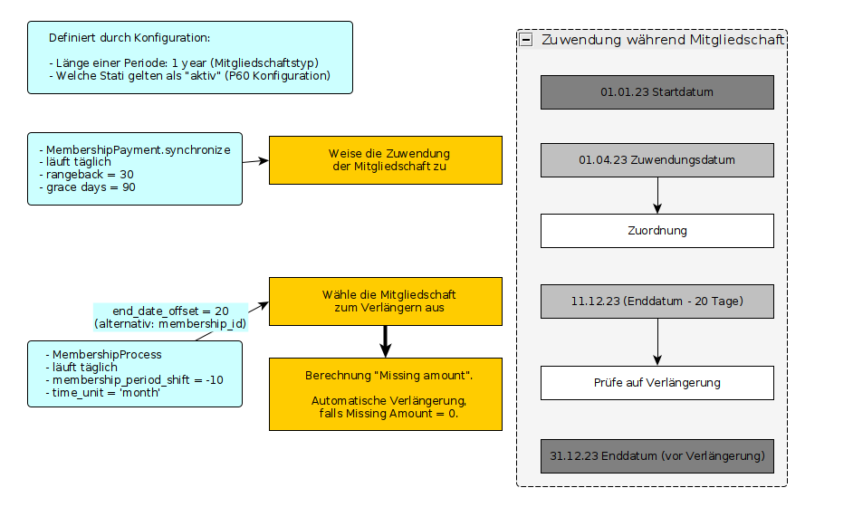
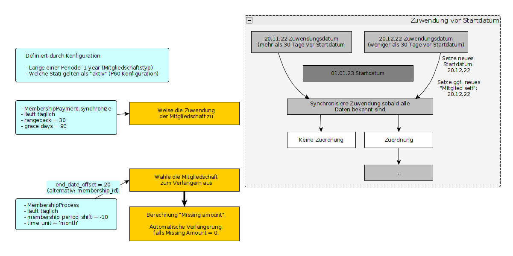
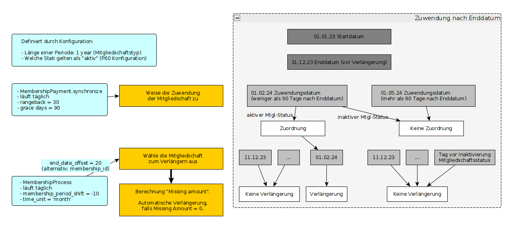
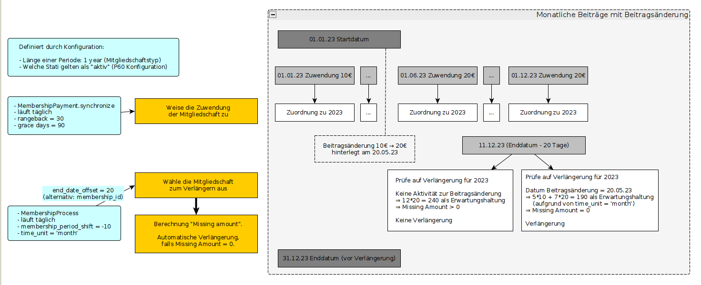
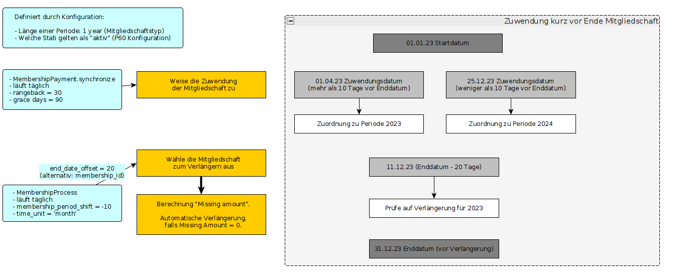

# Examples

The following graphs may help to understand how the Project 60 membership extension behaves in certain situations.
They only exist in German, though.

All examples assume two scheduled jobs that are configured to run daily: `MembershipPayment.synchronize` and `Membership.Process`.

## Contribution during active membership

## Contribution before start date

## Contribution after end date

## Annual fee change

In this case we assume a monthly payment of membership dues.

## Membership period shift

